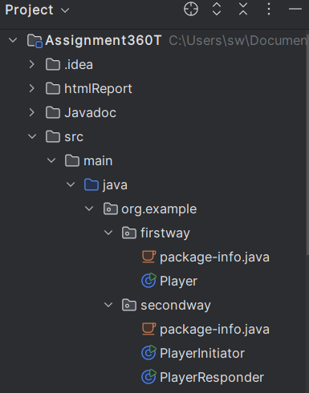
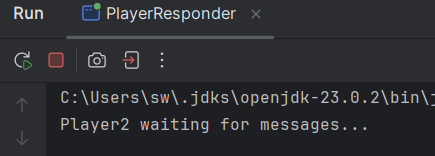
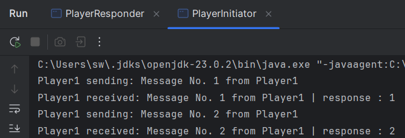
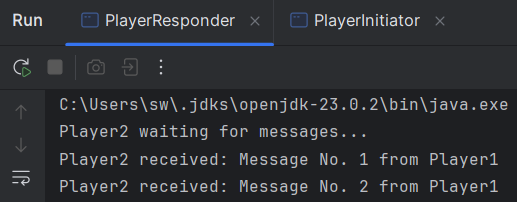

# <ins>Assignment-360T</ins>

## Requirements:


## Project Folder Structure:


The `org.example.firstway package` demonstrates **communication between two instances of the same class (Player)**.
On the other hand, the `org.example.secondway package` addresses **inter-process communication between separate Java processes**. 
In this package, two different Java files represent two players: `Player1 (PlayerInitiator)` and `Player2 (PlayerResponder)`.

## How to Run:
### First Question (two instances of same class communicating with each other):

1.	First go to `org.example.firstway package`.
2.	Start `Player` file.
3.	It will print the messages of `Player1` and `Player2` on the console as below screenshot.


_Fig. Communication between Player1 and Player2_

#### Note:
1. The above steps are for Intelij Idea ide. To run in cmd, first go to the folder directory where the java files are located by using the following command in cmd (Use this once you are inside the project directory) –
```
cd .\src\main\java\org\example\firstway\
```
2. Once inside the directory firstway, use the below command to convert `.java file to .class file` –
```
javac *.java
```
3. Now come to the root directory by using the below command –
```
cd C:\Users\<your user profile>\Documents\Java\Assignment360T
```
The above path is my folder structure, please change as per yours.
4. Now, run `Player.class` file by using the below command -
```
java -cp src/main/java org.example.firstway.Player
```
### Second Question (every player in a separate JAVA process):
1.	First go to `org.example.secondway package`.
2.	Start `PlayerResponder` which acts a server. This is `Player2` sends back the message received from `Player1` by sending new message that contains the received message concatenated with the message counter that this `Player2` sent.
3.	Now start `PlayerInitiator` which acts as a client and sends messages to the server(Player2) and prints the `PlayerResponder’s` response.



_Fig. PlayerResponder class when it starts_


_Fig. Running PlayerInitiator and printing the communication between PlayerInitiator and PlayerResponder_


_Fig. PlayerResponder receiving messages from PlayerInitiator_

4. If PlayerInitiator is started before PlayerResponder then it will throw an IOException with a message as below –


_Fig. Exception when we start PlayerInitiator first_


#### Note: 
1. The above steps are for Intelij Idea ide. To run in cmd, first compile both `PlayerInitiator` and `PlayerResponder`.
2. To compile the `.java file to .class file`, first go to the folder directory where the java files are located by using the following command in cmd (Use this once you are inside the project directory) –
```
cd .\src\main\java\org\example\secondway\
```

3. Once inside the directory secondway, use the below command to convert `.java file to .class file` –
````
javac *.java
````
4. Now come to the root directory by using the below command –
````
cd C:\Users\<your user profile>\Documents\Java\Assignment360T
````
The above path is my folder structure, please change as per yours.
5. Now, start the `PlayerResponder.class` file by using the below command followed by `PlayerInitiator.class`.
````
java -cp src/main/java org.example.secondway.PlayerResponder
java -cp src/main/java org.example.secondway.PlayerInitiator
````

### Javadoc file:
- Open the `index.html` file inside of it to get the javadoc project documentation.